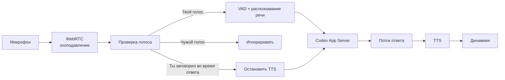

## Рекомендация

Сделать отдельный локальный **Codex Voice Bridge** поверх готового Pipecat. Он будет работать в браузере, слушать микрофон, проверять голос владельца и управлять Codex через `codex app-server`.

Мы возьмём готовый [Pipecat WebRTC voice-agent](https://github.com/pipecat-ai/pipecat-examples) и заменим его LLM-часть адаптером Codex. Pipecat уже предоставляет передачу звука, VAD, прерывания, STT/TTS и готовый web-клиент.

## Возможные варианты

| Вариант | Плюсы | Минусы | Решение |
|---|---|---|---|
| Официальный ChatGPT Voice + виртуальный микрофон | Родной интерфейс, текущая задача | Кнопка у тебя недоступна; фильтр голоса придётся встраивать на уровне PipeWire | Резервный |
| **Pipecat + Codex App Server + Eagle** | Настоящие прерывания, проверка голоса в реальном времени, работает локально | Eagle требует бесплатный аккаунт и AccessKey | **Основной** |
| Pipecat + Codex App Server + WeSpeaker | Полностью открытый стек | Больше настройки, выше задержка распознавания владельца | Свободная альтернатива |

Для строгой фильтрации я предлагаю [Picovoice Eagle](https://picovoice.ai/docs/eagle/). Он сравнивает голос с локальным профилем непрерывно, работает на CPU и поддерживает Linux x86_64. Аудио обрабатывается локально, но SDK требует AccessKey.

Если не хотим зависеть от проприетарного SDK, используем [WeSpeaker](https://github.com/wenet-e2e/wespeaker) с готовой ONNX-моделью.

## Готовые компоненты

- **Голосовой каркас:** [Pipecat](https://github.com/pipecat-ai/pipecat).
- **Web-интерфейс и WebRTC:** готовый `p2p-webrtc` пример и Pipecat Voice UI Kit.
- **Эхоподавление:** встроенная обработка WebRTC в браузере.
- **Определение речи:** Silero VAD, уже интегрирован в Pipecat.
- **Проверка владельца:** Picovoice Eagle.
- **Распознавание русского:** встроенный Pipecat `WhisperSTTService` на базе Faster Whisper.
- **Озвучивание:** встроенный `PiperTTSService`, русская модель Piper.
- **Codex:** уже установленный `codex app-server`.
- **Запуск на NixOS:** Nix dev shell и пользовательский systemd-сервис.

[Codex App Server](https://learn.chatgpt.com/docs/app-server) уже умеет:

- находить и возобновлять сохранённые треды;
- отправлять обычные сообщения;
- добавлять уточнения в выполняющийся запрос через `turn/steer`;
- прекращать выполнение через `turn/interrupt`;
- передавать ответ потоково.

## Как будет работать проверка голоса

### Регистрация

При первом запуске система попросит произнести несколько свободных фраз. Eagle создаст локальный голосовой профиль. Исходные записи после регистрации можно удалить.

### Обычный разговор

1. Микрофон постоянно передаёт очищенный звук.
2. Eagle выдаёт оценку сходства с твоим профилем.
3. Аудио проходит в Whisper только после подтверждения владельца.
4. Чужая речь, телевизор и голос TTS отбрасываются до транскрибации.
5. В Codex попадает только принятый текст.

### Перебивание

Если ты заговорил, пока Codex отвечает:

1. Через несколько сотен миллисекунд подтверждается твой голос.
2. Воспроизведение ответа сразу останавливается.
3. Фраза распознаётся.
4. Команда «стоп» вызывает `turn/interrupt`.
5. Уточнение вроде «нет, сделай по-другому» отправляется через `turn/steer`.

Чужой голос не должен останавливать ответ.

## План реализации

### 1. Проверить управление Codex без аудио

- Запустить локальный `codex app-server`.
- Получить список тредов.
- Проверить доступность текущей задачи.
- Возобновить тред и получить потоковый ответ.
- Проверить `turn/steer` и `turn/interrupt`.

Это определит, сможем ли мы подключаться именно к текущему чату. Если клиентская задача недоступна второму процессу, Voice Bridge заведёт постоянный голосовой тред с тем же аккаунтом, моделью, рабочей папкой и инструментами.

### 2. Развернуть готовый Pipecat-проект

- Форкнуть пример `p2p-webrtc`.
- Поднять локальную страницу с одной кнопкой подключения.
- Проверить двусторонний звук и штатное прерывание TTS.
- Использовать браузерное эхоподавление.

### 3. Добавить профиль владельца

- Подключить Eagle Profiler.
- Сделать экран регистрации голоса.
- Хранить профиль локально с правами `0600`.
- Добавить настройку порога и режим тестирования.
- Отбрасывать неподтверждённое аудио до STT и механизма прерывания.

### 4. Соединить речь с Codex

- Whisper преобразует принятую фразу в текст.
- Адаптер выбирает `turn/start`, `turn/steer` или `turn/interrupt`.
- Поток текста Codex делится на законченные предложения.
- Piper начинает читать ответ, не дожидаясь его полного завершения.
- События инструментов озвучиваются коротко: «запускаю тесты», «нашёл ошибку», «готово».

### 5. Упаковать для NixOS

- Проект в `/home/zephyr/dev/codex-voice`.
- Воспроизводимое окружение через `flake.nix`.
- Пользовательский systemd-сервис.
- Автозапуск вместе с системой.
- Интерфейс доступен только на `127.0.0.1`.
- Горячая клавиша для выключения микрофона.

### 6. Проверить качество

Критерии рабочего MVP:

- чужая речь не отправляется в Codex;
- чужая речь не прерывает ответ;
- твой голос останавливает TTS менее чем примерно за секунду;
- русская речь распознаётся стабильно;
- тред восстанавливается после перезапуска;
- исходное аудио не сохраняется;
- потеря соединения с Codex не ломает голосовой интерфейс.

## Важное ограничение

Проверка голоса хорошо отсекает людей рядом, телевизор и случайные звуки. Запись твоего голоса или качественный voice clone потенциально могут её обмануть. Поэтому подтверждение опасных команд лучше оставить кнопкой либо добавить случайную голосовую фразу-подтверждение.

**Итоговый стек для первого MVP:** Pipecat WebRTC + Eagle + локальные Whisper/Piper + Codex App Server. Собственного аудиодвижка, распознавания речи или модели голоса писать не потребуется.
